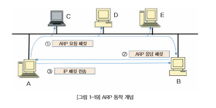
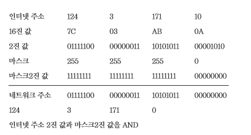
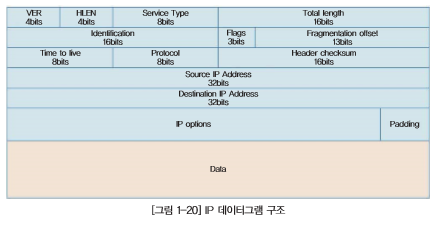
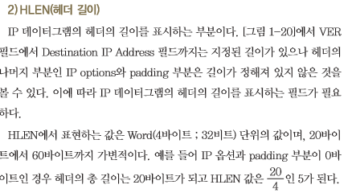
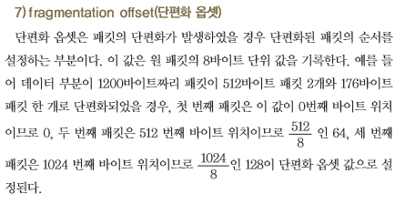

## kgsh 12기 전공 프로그래밍 network수업요약

##### 시험
* 연습문제
* 우리가 무슨 프로그래밍을 하는가
* 물리적 네트워크 장치들의 역할 (라우터, 허브 등... 자세히 보기)
* tcpip의 선조
* 네이트워크 물리적 구성요소, 구성 형태
* utp케이블의 규격 (랜선)
* ip v6에 대한것
* ip class: 앞이 무엇으로 시작하면 무엇인것
* 잘알려진 포트들
* 프로토콜 5가지중 개념적으로 설명 가능한것
* tcp와udp의 특징
* ip의 특징
* 각각의 단계들을 거치면서 데이터를 만드는 단위가 다른것
(데이터의 이름들이 다른것, 전송단위가 다른것)이것이 무엇인가
* arp동작 순서

**주관:**
* 서브넷 마스크 계산 (2무제로 나눠서 10점)
* ip데어터 그램에서 계산하는것 (두개중 하나)

 
---
### 우리는 무슨 프로그래밍을 하는가?
>** 네트워크 프로그래밍(소켓프로그래밍)**

네트워크 프로그래밍을 할때 **소켓**을 이용하여 프로그램을 작성한다.

네트워크 프로그래머들은 이런 네트워크 인프라 또는 하드웨어에 따라 서로다른 네트워크 프로그램을 작성해야하지만 이런 수고를
덜어주기 위해 운영체제는 **소켓**이라는 **공통의 네트워크 인터페이스**를 제공한다. 이로써 좀더 편리한 작업이 가능.

 
---
### 물리적 네트워크 장치들의 역할
> 인터넷은 네트워크가 네트워크를 연결하는 장치에 의해 두개 이상 연결된것을 말한다.
기본적으로 서로 다른 네트워크에 연결된 단말기는 직접 통신할수없다. 라우터 또는 게이트 웨이 같은 인터네트워킹장치들은 네트워크 사이를 연결해주는 역할을 하며
이들 네트원크 장치를 경유하여 서로다른 네트워크에 연결된 단말기들이 간접적으로 통신할수있다.

* #### 네트워크의 물리적 구성요소
  1. **정보단말기(terminal)**
    * 네트워크를 사용하는 실질적인 주체로서 다은 단말기와 정보를 주고받는데 사용되는 기기
    * 정보단말기는 터미널이라 부르며 네트워크 정보를 제공하는 실직적인 주체로써 호스트(host)라고도 한다.
    * pc , 노트북 , PDA , 휴대폰 , POS 등이있다.
  2. **네트워크 인터페이스 카드(NIC, NetworkInterface Card)**
    * 정보단말기를 네트워크에 연결해주는 장치, 네트워크 선로를 통해 자료를 보내거나 받는 기능을 수행
    * 우리가 대부분 사용하는 네트워크는 이더넷으로 연결되어 있으며, 이더넷에 연결하기위한 네트워크 인터페이스 카드(NIC)를
    이더넷 카드라고 한다. (일반적으로 NIC를 랜카드 또는 네트워크 카드라 부름)
    * 이더넷 카드, 무선랜 카드, 광랜 카드, 모뎀 등이있다.
  3. **허브(Hub)**
    * 네트워크를 성형(star 형)으로 구성할때 각각의 단말을 연결하기 위해 사용하는 장치
    * 단말을 연결하는 방식에 따라 여러 형태가 있음: **성(star)형, 버스(bus)형, 링(ring)형**  
    (이중에서는 성형을 주로 가장많이 쓴다.)
    * 네트워크에 연결하기위해서는 허브가 필요하며 **더비허브**와 **스위칭 허브**로 구분 할수있다.  
    ** 더미 허브: ** 하나의 단말기가 네트워크를 사용하는 순간 다른 단말기가 네트워크 사용 불가  
    &nbsp; &nbsp;&nbsp; &nbsp;&nbsp; &nbsp;&nbsp; &nbsp;&nbsp; &nbsp;&nbsp; &nbsp;
    100mbs의 속도를 가질때 모든기기가 합해서 100mbs 사용가능. 
    ** 스위칭 허브: ** :여러대의 단말기들이 동시에 네트워크 사용가능. 
    &nbsp; &nbsp;&nbsp; &nbsp;&nbsp; &nbsp;&nbsp; &nbsp;&nbsp; &nbsp;&nbsp; &nbsp;&nbsp;  &nbsp;&nbsp;
    100mbs의 속도를 가질때 모든 단말이 각각 100mbs 사용가능. 
  4. **중계기(Repeater)**
    *  네트워크 전송거리가 길어지는 경우 정상적인 통신이 되지 않는것을 방지하기위해 중간신호를 증폭시키는 장치이다.
    100m까지 신호전달이가능한 cat-5케이블 중간에 설치하면 100m이상의 거리에도 연결가능.

  5. **브리지(Bridge)**
    * 규모가 큰 네트워크를 작은 단위인 세그먼트로 구분하기위해 사용한다.  
    (동일 세그먼트에 있는 호스트임을 확인하기위해서는 NIC의 하드웨어 주소를 사용)
  6. **라우터(Router)와 게이트웨이(Gateway)**
    * 네트워크 주소를 이용하여 데이터를 최적의 경로로 찾아가게 해주는 장치이다.  (네트워크와 네트워크를 연결하는 인터네트워킹 장치)
    * 전송할 데이터릐 목적지를 파악하여 가장 적절한 경로를 통해 전송할수있도록 도와줌.  
    (단순히 길고 짧음만을 비교하는것이 아닌 회선의 속도, 고장의 유무도 체크함)
    * **라우터**는 동일한 종류의 네트워크를 연결하기 위한 장치.
    * **게이트 웨이**는 다른종류의 네트워크를 연결할수있는 장치.

---
### TCP/IP의 선조
* 구글 참고.
인터넷 프로토콜 스위트(영어: Internet Protocol Suite)는 인터넷에서 컴퓨터들이 서로 정보를 주고받는 데 쓰이는 통신규약(프로토콜)의 모음이다.  인터넷 프로토콜 스위트 중 TCP와 IP가 가장 많이 쓰이기 때문에 TCP/IP 프로토콜 스위트라고도 불린다.
f
---

### 네트워크 물리적 구성요소 & 구성형태

예제) **종합문제(3번)**. 네트워크를 구성하는 물리적 구성요소 
 * ** NIC, hub, repeater, router , 정보단말기(Terminal), gateway** 
TCP는 아님.
 * hub 의 구성형태 종류: **성형, 버스 형, 링 형**

---

### UTP케이블의 규격

---

### IPV6에 관해
* 32비트 기반의 ipv4가 가질수있는 최대 호스트 수가 부족해져 
이를 대체하기위해 만들어진 ip주소 형식.
---

### IPclass
>** 네트워크의 규모에 따라 몇가지의 네트워크 주소체계가 존재하며 이를 주소 클래스라한다.**

* **클래스A**
  * 최상위 비트가 0으로 시작, 상위 1바이트가 네트워크 주소, 나머지 3바이트가 호스트 주소인 클래스
  * **0~127**로 시작하는 호스트 주소
  * ** EX)123.4.5.6:**  서브넷마스크:**255.0.0.0**,  네트워크 주소: 123.0.0.0,  호스트 주소: 4.5.6  
  * **256 X 256 X 256개**의 호스트 주소를 가질수 있다.
* **클래스B**
  * 최상위 비트가 10으로 시작하고 산위 2바이트가 네트워크 주소, 나머지 2바이트가 호스트 주소인 클래스
  * **128~191**로 시작하는 호스트 주소
  * 서브넷 마스크 **255.255.0.0**
  * **256 X 256개**의 호스트 주소
* **클래스C**
  * 최상위 비트가 110으로 시작 상위3바이트가 네트워크 주소 나머지 1바이트가 호스트 주소인 클래스
  * **192~223**으로 시작하는 호스트 주소
  * 서브넷 마스크: **255.255.255.0**
  * **256개**의 호스트 주소
* **클래스D**
  * 인터넷 방송을 위해 사용하는 주소
  * 멀티캐스트
* **클래스E**
  * 실제로 사용 X
  * 인터넷 주소가 부족할때를 대비하여 예약되어 있는 주소

---

### 잘알려진 포트들
>** 잘알려진 포트(Well-known prot) 0~1023범위의 포트 번호를 말한다.  
  TCP/IP를 이용한 이더넷 서비스가 시작될때 대부분 다른 서비스에서 사용되고 있는 번호 
  (소켓프로그래밍을 작성할때 이 포트번호들은 피해서 사용하는것이 좋다.)**

  * **80**번 포트 : **웹**서비스
  * **25번** 포트 : **전자우편** 서비스
  * **21**번 포트 : **FTP** 서비스
  * **23**번 포트 : **터미널 접속** 서비스

---

### 프로토콜 5가지
>** 프로토콜은 국제적표준인지 아닌지에 따라 나누어진다.** 
   **표준통신 프로토콜:** 국제표준으로 지정되어 해단서비스를 모든 나라에서 공통적인 규칙을 이룔해서 사용하것. 
   (TCP/IP, ARP, RARP, ICMP,IGMP,http,telnet,ftp,smtp,ssh) 
   **사용자 정의 프로토콜:** 네트워크 프로그래머가 자신의 응용프로그램에 맞게 임의로 만들어 사용하는것.

   1. ARP
   2. ICMP
    * ping  
       메세지 종류: 질의, 메세지번호: 8, 메세지 의미: 에코요청
       메세지 종류: 질의, 메세지번호: 0, 메세지 의미: 에코응답
   3. IGMP

---

### TCP와 UDP의 특징
>** TCP:** 신뢰성있는 전송을 보장하기위해 만들어진 인터넷 프로토콜이다.  
** UDP:** 정확성 보다는 빠른 데이터 전송을 목적으로 하는 데이터에 적합한 프로토콜이다.

 * TCP의 특징
    1. TCP프로토콜은 연결 지향적 프로토콜이다.
    2. TCP프로토콜이 전송하려는 데이터는 스트림으로서 순차성이 있다.
    3. TCP프로토콜은 흐름제어를 수행한다.
    4. TCP는 오류제어를 수행한다.
    5. TCP는 네트워크 다중화를 지원한다.
    6. TCP프로토콜은 전이중 서비스다.

* UCP의 특징
    1. 무결성을 보장하는TCP는 많은 확인 패킷을 사용하기에 송수신 속도가 떨어지나  
    UDP는 이러한 과정을 거의대부분 거치지 않으며 으로써 빠른 데이터 전송이 가능. 
    (사용예: 인터넷 방송, 인터넷 음악 방송 등..)
---

### IP의 특징
>** IP프로토콜(인터넷 프로토콜): ** 인터넷의 근간을 이루는 주 프로토콜로  
네트워크 간의 연결을 통한 호스트 간의 경로 설정과 자료 전송을 담당하는 프로토콜

* IP의 특징
  1. TCP/IP에서 전송을 담당하는 프로토콜
  2. 신뢰성이 보장되지 않은 비 연결 전송 구조 
  (패킷을 올바르세 목적지까지 보내기위해 최선을 다하나 완젹한 전송을 보장하지 않음.) 
  (전기적 충격이나 선로에서의 잡음으로인한 데이터 변질, 라우터의  패킷버림 등.. 의 변수가있으나 손실율은 0%에 가깝다.)

---

### ARP동작 순서
>** ARP :** 주소변환 프로토콜, 인터넷 주소를 네트워크 카드의 물리 주소  로 변환해주는 프로토콜

1. 요청 패킷을 만듦 (요청 패킷안에는 자신의 인터넷 주소, 물리주소와 목적지의 인터넷주소가 담김.) 
필드에는 요청으로 설정한다.
2. 이와 같이 만들어진 arp패킷을 네트워크에 방송한다.
3. 1번단계) 이와 같이 방손된 패킷은 네트워크에 연결된 모근 컴퓨터에서 받게된다.
4. 패킷을 받은 각각의 컴퓨터들은 요청패킷을 확인하여 목적지의 주소가 자신의 것인지 아닌지를 확인하여  
자신의 것일 경우 패킷에 반응한다. 이후 응답 패킷에 24비트로 된 자신의 하드웨어 주소를 입력하여 arp응답패킷을<br.>
a에게 직접 전송한다.
5. a는 arp응답 패킷을 받고 목적지 ip주소를 가진 하드웨어의 주소를 얻는다.  
그리고 ip패킷을 목적 하드웨어 주소로 전송하게된다.

<!>ARP의 반대 개념 RARP

---

### (주관) 서브넷 마스크 계산
>** 네트워크 프로그래밍(소켓프로그래밍)**

---

### IP데이터 그램에서 계산하는것(둘중하나)

 * **HLEN(헤더길이)** 

 * **fragmentation offset(단편화 옵셋)** 

---

### 단원 평가
>** 네트워크 프로그래밍(소켓프로그래밍)**

  1. 네트워크 프로그램을 쉽게 개발할 수있도록 운영체제에서 제공하는  
  네트워크 관련 인터페이스  
   * **소켓**

  2. 네트워크와 네트워크를 연결해주는 인터네트워킹 장치는?  
   * **라우터, 게이트웨이**

  3. 네트워크를 구성하는 물리적 구성요소 
   * ** NIC, hub, repeater, router , 정보단말기(Terminal), gateway** 
  TCP는 아님.

  4. 인터네트워킹 장치로서 서로 다른종류의 네트워크를 연결하기 위해 사용되는 장치는? 
    * **게이트웨이** 
  <!>라우터는 같은것 끼리

  5. 다음중 인터넷 주소 형식 
   * **255이하의 수 4개를 점으로 구분하여 사용**

  6. 현재 인더넷에서 사용 하고있는 아이피 주소인 ipv4는 몇비트인가? 
   * **32비뜨**

  7. 아이피 주소가 124.3.171.10 이고 서브넷 마스크가 255.255.255.0일때 네트워크 주소는 무엇인가? 
    * **124.3.171.0**(아이피 주소와 서브넷 마스크를 이진 and연산을 통해 얻을수있다.)

  8. 자기가신의 호스트를 가리키는 인터넷 주소는? 
    * **127.0.0.1**

  9. 문자로 이루어진 도메인 명을 숫자로 된 인터넷 주소로 변환 시켜주는 서비스 
    * **DNS**

  10. TCP와 UDP프로토콜이 모두 지원하는 개념으로 하나의 네트워크를  여러 서비스가 이용 할수있도록
  다중화를 지원하는 개념은? 
    * **PORT**

  11. 인터넷에서 사용하는 논리적 인터넷 주소를 물리적인 하드웨어 주소로  변환 시켜주는 프로토콜은? 
    * **ARP**

  12. 인터넷에서 발생하는 오류를 전송하고 네트워크 제어를 위해 사용하는 프로토콜  
    * **ICMP**

  13. 인터넷의 주 프로토콜로서 TCP/IP에서 실제 전송을 담당하며 신뢰성이 보장되지 않는  
  비연결 전송 구조로 되어 있는 네트워크 계층의 프로토콜은 무엇인가?  
    * **IP**

  14. 다음중 네트워크 다이어그램에 포함되는 정보  
   * **source IP addres**  
   * **destination  IP addres**  
   * **header checksum **  
   * **time to live **  
  (port번호는 아님.)

  15. TCP프로토콜의 특징 
    * **연결 지향적 프로토콜**
    * **스트림으로서 순차성이 있다.**
    * **흐름제어를 수행 한다.**
    * **오류 제어를 수행한다.**

  16. 다음중 TCP 접속에 사용되는 절차는? 
    * **3 - way handshaking**

  17. TCP 접속 종료에 사용되는 절차는? 
   * **4 - way handshaking**

  18. 계층구조를 가지는 네트워크에서 상위계층에서 요청한 데이터를 자신의 프로토콜 헤더를 첨부하여
  하위계층에 전송요구하는 방식으로 데이터가 포장되는 개념 
   * **캡슐화**

  19. TCP의 신뢰성 있는 자료전송 방식 때문에 속도가 저하되는 문제를 해결하기위해 만든 프로
  토콜로서 일부 손실이 발생하더라도 큰 문제가 되지 않는 다량의 멀티미디어 자료 전송에 적합한
  전송계층의 프로토콜은?
   * **UDP**

  20. 인터넷 프로토콜ㅇ인 TCP 서비스와 대응되는 OSI참조계층
   * **전송계층**(TCP와 UDP프로토콜은 전송계층에 속함.)

  21.  인터넷 프로토콜인 IP서비스와 대응되는 OSI참조 계층은?
   * **네트워크 계층** (IP프로토콜은 네트워크 게층에 속함.)
